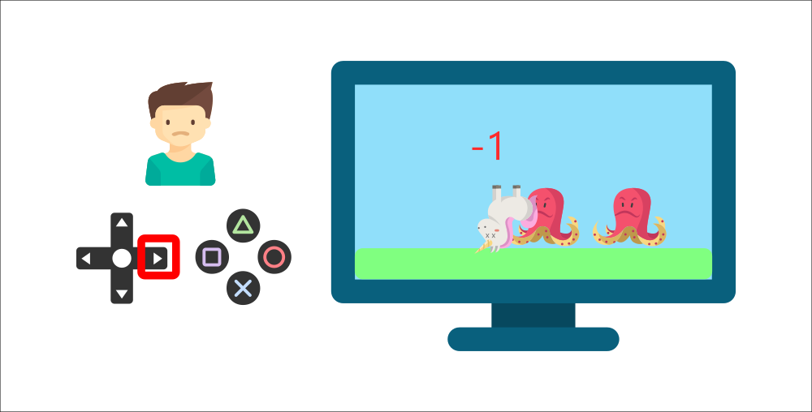

# 基本概念

## 什么是强化学习？

强化学习是一种解决控制任务（也称为决策问题）的框架，通过构建智能体与环境互动，从中学习。智能体（Agent）通过试错的方式与环境交互，并根据获得的奖励（正面或负面）作为独特的反馈进行学习。

### 玩游戏的例子

想象一下有个孩子在从未玩过的视频游戏前，给他一个控制器，然后让他独自玩。

通过按下正确的按钮（动作）与环境（视频游戏）互动。他获得了一个金币，这是一个 +1 的奖励。这是正面的，他明白了在这个游戏中他必须获得金币。

但是，然后他再次按下正确的按钮，结果碰到了敌人。他刚刚死掉，所以这是一个 -1 的奖励。

通过试错与环境互动，他明白了他需要在这个环境中获取金币，同时避免敌人。在没有任何监督的情况下，这个孩子会越来越擅长玩这个游戏。

这就是人类和动物学习的方式，通过互动。强化学习只是从行动中学习的一种计算方法。

### 网格世界的例子

书中采用了如下网格世界的例子，一个机器人（agent）在网格世界里面移动。

- 在每个时刻，agent 只能占据一个格子。
- 白色的格子是可以进入的，橙色的格子是禁止进入的
- Agent 的目标是到达 Target 格子

最终的目标是 Agent 找到一个好的 **策略（Policy）** 能够从任何一个起点到达 Target 格子。 Agent 通过在网格世界里面进行互动，来找到一个好的策略。

## 基本概念

### 状态（State）

**状态（State）** 是 Agent 在环境中所处的状态。

在玩游戏的例子中，State 为当前的游戏画面。在网格世界的例子中，State 就是 Agent 在网格中的位置。

**状态空间（State Space）** 就是所有可能状态的集合。状态空间可能是连续的或者离散的。在玩游戏的例子中，状态空间就是连续的，是一个无线的集合。在网格世界的例子中，状态空间就是离散的。

通常将状态空间（State Space）表示为 $\mathcal{S}$。

在网格的世界例子中，总共有 9 个状态，分别表示为 $s_1, s_2, s_3, s_4, s_5, s_6, s_7, s_8, s_9$。
状态空间可以表示为：$\mathcal{S} = \{s_1, ..., s_9\}$

## 动作（Action）

**动作（Action）** 就是 Agent 在当前状态下能够采取的行动（策略）。

在玩游戏的例子中，Agent 的动作可能是向前，向后，向上三个动作中的一种。在网格世界的例子中，Agent 的动作是向上，向下，向左，向右，保持不动 5 种动作之一。

**动作空间（Action Space）** 就是所有可能动作的集合。动作空间也可以是离散或连续的，可以是有限或无限集合。一个连续的动作空间的例子是机器人手臂的角度，一个离散的动作空间的例子是游戏中的上下左右按键。

通常将动作空间（Action Space）表示为 $\mathcal{A}$。

在网格世界的例子中，将 5 个动作空间可以表示为：$\mathcal{A} = \{a_1, a_2, a_3, a_4, a_5\}$。不同的状态下可能有不同的动作空间。

## 状态转移（State transition）

**状态转移（State transition）** 就是从当前状态采取一个动作后，转移到下一个状态的过程。状态转移可以是确定性的，也可以是随机的。

在网格世界的例子中，如果 Agent 在状态 $s_1$ 采取向右移动的动作 $a_2$，那么它一定会转移到状态 $s_2$。这就是一个确定性的状态转移。

**状态转移概率（State transition probability）** 通常用 $p(s'|s,a)$ 表示，表示在状态 $s$ 下采取动作 $a$ 后转移到状态 $s'$ 的概率。

状态转移可以是确定性，在网格世界的例子中，从 $s_1$ 状态下，采取动作 $a_2$ 转移到各个状态下的概率为：

$p(s_2|s_1,a_2) = 1$
$p(s_i|s_1,a_2) = 0, i \neq 2$

也就是说，从状态 $s_1$ 采取向右移动的动作 $a_2$ 后，一定会转移到状态 $s_2$，转移到其他状态的概率为 0。

状态转移也可以是随机的。例如，在一个有风的网格世界中，Agent 在状态 $s_1$ 采取向右移动的动作 $a_2$ 时，有 80% 的概率会转移到状态 $s_2$，有 20% 的概率会被风吹到状态 $s_4$。这种情况下的状态转移概率为：

$p(s_2|s_1,a_2) = 0.8$
$p(s_4|s_1,a_2) = 0.2$ 
$p(s_i|s_1,a_2) = 0, i \neq 2,4$

## 策略（Policy）

**策略（Policy）** 是 Agent 根据观测到的状态，如何做出决策，即如何从动作空间中选取一个动作。强化学习的目标就是得到一个策略函数，在每个时刻根据观测到的状态做出决策。策略可以是确定性的，也可以是随机性的。

### 随机策略（Stochastic policy）

**随机策略（Stochastic policy）** 通常表示为 $\pi$，

$\pi$: $\mathcal{S} \times \mathcal{A} \rightarrow [0,1]$，是一个条件概率分布：

$\pi(a|s) = P(A = a|S = s)$

表示在状态 $s$ 下采取动作 $a$ 的概率，记为 $\pi(a|s)$，是一个 0 到 1 的概率值。

对于任意状态 $s$，满足：$\sum_{a \in \mathcal{A}} \pi(a|s) = 1$

例如，在网格世界中，Agent 在状态 $s_1$ 下可能采取如下随机策略：
- 以 0.6 的概率向右移动：$\pi(a_2|s_1) = 0.6$
- 以 0.3 的概率向下移动：$\pi(a_4|s_1) = 0.3$ 
- 以 0.1 的概率保持不动：$\pi(a_5|s_1) = 0.1$
- 向左和向上移动的概率为 0：$\pi(a_1|s_1) = \pi(a_3|s_1) = 0$

## 确定策略（Deterministic policy）

**确定策略（Deterministic policy）** 通常表示为 $\mu$，是一个从状态空间到动作空间的确定性映射：

$\mu: \mathcal{S} \rightarrow \mathcal{A}$

表示在状态 $s$ 下，Agent 一定会采取动作 $\mu(s)$。确定策略可以看作是一种特殊的随机策略，即在某个状态下采取某个动作的概率为 1，采取其他动作的概率为 0：

$\pi(a|s) = \begin{cases} 1, & \text{if } a = \mu(s) \\ 0, & \text{otherwise} \end{cases}$

例如，在网格世界中，Agent 在状态 $s_1$ 下可能采取如下确定策略：
- 一定向右移动：$\mu(s_1) = a_2$

## 轨迹（trajectory）

## 参考文献
- https://github.com/MathFoundationRL/Book-Mathematical-Foundation-of-Reinforcement-Learning
- https://huggingface.co/learn/deep-rl-course/unit1/what-is-rl
- https://en.wikipedia.org/wiki/Reinforcement_learning
- https://github.com/wangshusen/DRL?tab=readme-ov-file
- https://spinningup.openai.com/en/latest/spinningup/rl_intro.html