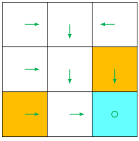

# 基本概念

## 什么是强化学习？

强化学习是一种解决控制任务（也称为决策问题）的框架，通过构建智能体与环境互动，从中学习。智能体（Agent）通过试错的方式与环境交互，并根据获得的奖励（正面或负面）作为独特的反馈进行学习。

### 玩游戏的例子

想象一下有个孩子在从未玩过的视频游戏前，给他一个控制器，然后让他独自玩。

通过按下正确的按钮（动作）与环境（视频游戏）互动。他获得了一个金币，这是一个 +1 的奖励。这是正面的，他明白了在这个游戏中他必须获得金币。

但是，然后他再次按下正确的按钮，结果碰到了敌人。他刚刚死掉，所以这是一个 -1 的奖励。

通过试错与环境互动，他明白了他需要在这个环境中获取金币，同时避免敌人。在没有任何监督的情况下，这个孩子会越来越擅长玩这个游戏。

这就是人类和动物学习的方式，通过互动。强化学习只是从行动中学习的一种计算方法。

### 网格世界的例子

书中采用了如下网格世界的例子，一个机器人（Agent）在网格世界里面移动。

- 在每个时刻，Agent 只能占据一个格子。
- 白色的格子是可以进入的，橙色的格子是禁止进入的。
- Agent 的目标是到达 Target 格子

最终的目标是 Agent 找到一个好的 **策略（Policy）** 能够从任何一个起点到达 Target 格子。 Agent 通过在网格世界里面进行互动，来找到一个好的策略。

## 基本概念

### 状态（State）

**状态（State）** 是 Agent 在环境中所处的状态。

在玩游戏的例子中，State 为当前的游戏画面。在网格世界的例子中，State 就是 Agent 在网格中的位置。

**状态空间（State Space）** 就是所有可能状态的集合。状态空间可能是连续的或者离散的。在玩游戏的例子中，状态空间就是连续的，是一个无限的集合。在网格世界的例子中，状态空间就是离散的。

通常将状态空间（State Space）表示为 $\mathcal{S}$。

在网格的世界例子中，总共有 9 个状态，分别表示为 $s_1, s_2, s_3, s_4, s_5, s_6, s_7, s_8, s_9$。
那么状态空间可以表示为：$\mathcal{S} = \{s_1, ..., s_9\}$。

## 动作（Action）

**动作（Action）** 就是 Agent 在当前状态下能够采取的行动（策略）。

在玩游戏的例子中，Agent 的动作可能是向前走，向后走，向上跳三个动作中的一种。在网格世界的例子中，Agent 的动作是向上，向下，向左，向右，保持不动 5 种动作之一。

**动作空间（Action Space）** 就是所有可能动作的集合。动作空间也可以是离散或连续的，可以是有限或无限集合。一个连续的动作空间的例子是机器人手臂的角度，一个离散的动作空间的例子是游戏中的上下左右按键。

通常将动作空间（Action Space）表示为 $\mathcal{A}$。

在网格世界的例子中，将 5 个动作空间可以表示为：$\mathcal{A} = \{a_1, a_2, a_3, a_4, a_5\}$。不同的状态下可能有不同的动作空间。

## 状态转移（State transition）

**状态转移（State transition）** 就是从当前状态采取一个动作后，转移到下一个状态的过程。

**状态转移概率（State transition probability）** 通常用条件概率 $p(s'|s,a)$ 表示，表示在状态 $s$ 下采取动作 $a$ 后转移到状态 $s'$ 的概率。

状态转移可以是确定性，在网格世界的例子中，从 $s_1$ 状态下，采取动作 $a_2$ 转移到各个状态下的概率为：

$p(s_2|s_1,a_2) = 1$
$p(s_i|s_1,a_2) = 0, i \neq 2$

也就是说，从状态 $s_1$ 采取向右移动的动作 $a_2$ 后，一定会转移到状态 $s_2$，转移到其他状态的概率为 0。

网格世界的所有状态转移可以用表格来表示：

状态转移也可以是随机的。例如，在一个有风的网格世界中，Agent 在状态 $s_1$ 采取向右移动的动作 $a_2$ 时，有 80% 的概率会转移到状态 $s_2$，有 20% 的概率会被风吹到状态 $s_4$。这种情况下的状态转移概率为：

$p(s_2|s_1,a_2) = 0.8$
$p(s_4|s_1,a_2) = 0.2$ 
$p(s_i|s_1,a_2) = 0, i \neq 2,4$

## 策略（Policy）

**策略（Policy）** 是 Agent 根据观测到的状态，如何做出决策，即如何从动作空间中选取一个动作。强化学习的目标就是得到一个策略函数，在每个时刻根据观测到的状态做出决策。策略可以是确定性的，也可以是随机性的。

### 随机策略（Stochastic policy）

**随机策略（Stochastic policy）** 通常表示为 $\pi$，

$\pi: \mathcal{S} \times \mathcal{A} \rightarrow [0,1]$，是一个条件概率分布：

$$ \pi(a|s) = P(A = a|S = s) $$

表示在状态 $s$ 下采取动作 $a$ 的概率，记为 $\pi(a|s)$，是一个 0 到 1 的概率值。

对于任意状态 $s$，满足：

$$\sum_{a \in \mathcal{A}} \pi(a|s) = 1$$

例如，在网格世界中，Agent 在状态 $s_1$ 下可能采取如下随机策略：
- 以 0.6 的概率向右移动： $\pi(a_2|s_1) = 0.6$
- 以 0.3 的概率向下移动： $\pi(a_4|s_1) = 0.3$ 
- 以 0.1 的概率保持不动： $\pi(a_5|s_1) = 0.1$
- 向左和向上移动的概率为 0： $\pi(a_1|s_1) = \pi(a_3|s_1) = 0$
  
该状态下所有动作的概率总和为 1。

## 确定策略（Deterministic policy）

**确定策略（Deterministic policy）** 通常表示为 $\mu$，是一个从状态空间到动作空间的确定性映射：

$$\mu: \mathcal{S} \rightarrow \mathcal{A}$$

表示在状态 $s$ 下，Agent 一定会采取动作 $\mu(s)$。确定策略可以看作是一种特殊的随机策略，即在某个状态下采取某个动作的概率为 1，采取其他动作的概率为 0：

$$\pi(a|s) = \begin{cases} 1, & \text{if } a = \mu(s) \\ 0, & \text{otherwise} \end{cases}$$

例如，在网格世界中，Agent 在状态 $s_1$ 下可能采取如下确定策略：
- 一定向右移动：$\mu(s_1) = a_2$

网格世界中确定性的策略可以用表格中的箭头来表示：

## 奖励（Reward）

**奖励（Reward）** 是指在某个状态下，Agent 执行一个动作而从环境获得的反馈。

奖励通常表示为 $r$，它是状态 $s$ 和动作 $a$ 的函数，即 $r: \mathcal{S} \times \mathcal{A} \rightarrow \mathbb{R}$，表示为 $r(s,a)$。奖励可以是正的也可以是负的，或者是 0。

不同的奖励会对 Agent 学习到的策略有不同的影响。通常情况下，当奖励为正时，会鼓励 Agent 采取对应的动作；当奖励为负时，会抑制 Agent 采取对应的动作。奖励为 0 时，表示该动作对 Agent 的目标没有影响。

在网格世界的例子中，奖励定义可以如下：
- 当 Agent 尝试穿过边界时：$r_{boundary}=-1$。
- 当 Agent 尝试进入禁止格子时：$r_{forbidden}=-1$。
- 当 Agent 到达目标格子时：$r_{target}=-1$。
- 其他状态下的动作获得奖励：$r_{other}=0$。

网格世界中可以用表格的方式来表示所有状态下的奖励：

## 轨迹（trajectory）和回合（episode）

**轨迹（trajectory）** 是一个 state-action-reward 的链。当遵循一个策略（policy），Agent 采取了一系列的动作，最后到达某个状态而产生的 state-action-reward 链。可以表示为：

$$ (s_1, a_1, r_1, s_2, a_2, r_2, s_3, a_3, r_3, ...) $$

如图（a）所示，Agent 生成的轨迹为：

$$ s_1 \xrightarrow[r=0]{a_2} s_2 \xrightarrow[r=0]{a_3} s_5 \xrightarrow[r=0]{a_3} s_8 \xrightarrow[r=1]{a_2} s_9 $$

当遵循一个策略（policy），Agent 采取了一系列的动作和环境互动，最终到达某个终止的状态，这一系列的轨迹称之为**回合（episode）**。

在网格世界的例子中，一个回合就是从起始格子到目标格子的完整路径。回合可以是有限长度的（如网格世界），也可以是无限长度的（如持续性任务）。在网格世界中也可以定义无限长度的轨迹，比如我们可以设计一个策略，在到达 $s_9$ 后不会停止，会不断采取停留在 $s_9$ 的动作，从而产生的轨迹：

$$ s_1 \xrightarrow[r=0]{a_2} s_2 \xrightarrow[r=0]{a_3} s_5 \xrightarrow[r=0]{a_3} s_8 \xrightarrow[r=1]{a_2} s_9 \xrightarrow[r=1]{a_2} s_9 \xrightarrow[r=1]{a_2} s_9 ...$$

## 回报（Return）

**回报（Return）** 是指从当前时刻开始，Agent 在一个轨迹上获得的所有奖励的累加和，所以回报也叫做**累计奖励（cumulative future reward 或 cumulative reward）**。

因此奖励（Reward）也被称为**即时奖励（immediate reward）**，而**回报（Return）** 是即时奖励的累加和。

通常用 $G_t$ 表示从时刻 $t$ 开始的回报：

$$ G_t = r_{t} + r_{t+1} + r_{t+2} + r_{t+3} + ... $$

在上图（a）中的 Policy 1 的回报为

$$ return = 0 + 0 + 0 + 1 = 1 $$

在上图（b）中的 Policy 2 的回报为

$$ return = 0 + -1 + 0 + 1 = 0 $$

在实际应用中，为了使回报有限，通常会引入**折扣因子（discount rate） $\gamma \in [0,1]$**，使得未来的奖励会被打折：

$$ G_t = r_{t} + \gamma r_{t+1} + \gamma^2 r_{t+2} + ... = \sum_{k=0}^{\infty} \gamma^k r_{t+k} $$

折扣因子可以用来调整对近期和远期奖励的重视程度。$\gamma$ 越小，Agent 越重视短期奖励；$\gamma$ 越大，Agent 越重视长期奖励。当 $\gamma=0$ 时，Agent 只关注即时奖励；当 $\gamma=1$ 时，所有时刻的奖励权重相同。

对于网格世界中，在上图（a）中的 Policy 1 无限回合的**折扣回报（discounted return）** 计算如下：

$$ G_t = 0 + \gamma \cdot 0 + \gamma^2 \cdot 0 + \gamma^3 \cdot 1 + \gamma^4 \cdot 1 + \gamma^5 \cdot 1 + ... =  \gamma^3 + \gamma^4 + ... = \gamma^3 \frac{1}{1-\gamma} $$

强化学习的目标就是寻找一个策略，使得回报的期望最大化。这个策略称为**最
优策略 (optimum policy)**。

## 马尔可夫决策过程（Markov decision processes）

**马尔可夫决策过程（Markov decision processes，简称为 MDP）** 是一个描述随机动态系统的通用框架。MDP 的关键因素如下：

- 集合（Sets）
  - 状态空间（State space）：所有状态的集合，表示为 $\mathcal{S}$。
  - 动作空间（Action space）：与每个状态 $ s \in \mathcal{S} $ 相关的动作集合，表示为 $\mathcal{A(s)}$。
  - 奖励集合（Reward set）：与每一个状态-动作对 $(s, a)$ 相关联的奖励集合，表示为 $\mathcal{R(s,a)}$。
- 模型（Model）
  - 状态转移概率（State transition probability）：在状态 $s$ 下，采取动作 $a$ 时，转移到状态 $s'$ 的概率是 $p(s'|s, a)$。对任意 $(s,a)$， 满足 $\sum_{s' \in \mathcal{S}} p(s'|s, a)=1 $。
  - 奖励概率（Reward probability）：在状态 $s$ 下，采取动作 $a$ 时，获得奖励 $r$ 的概率是 $p(r|s,a)$。对于任意 $(s,a)$ ，满足 $\sum_{r' \in \mathcal{R(s,a)}} p(r|s, a)=1$。
- 策略（Policy）
  - 在状态 $s$ 下，选择动作 $a$ 的概率是 $\pi(a|s)$。同时对于所有的 $s\in \mathcal{S}$，满足$\sum_{a \in \mathcal{A(s)}} p(a|s)=1$。
- 马尔可夫性质（Markov property）
  - 马尔可夫性质指的是随机过程的无记忆性性质。在数学上，它表示为
  $ p(s_{t+1}| s_t,a_t,s_{t-1},a_{t-1},...,s_0,a_0) = p(s_{t+1}| s_t,a_t)$
  $ p(r_{t+1}| s_t,a_t,s_{t-1},a_{t-1},...,s_0,a_0) = p(r_{t+1}| s_t,a_t)$
  其中 $t$ 表示当前时间时刻，$t+1$ 表示下一个时刻。这意味着系统的下一个状态或奖励只取决于当前状态和当前动作，而与历史状态和动作无关。这大大简化了问题的复杂度，因为我们只需要考虑当前状态，而不需要记住整个历史轨迹。

最终，强化学习可以被描述为一个 Agent 与环境交互的马尔可夫决策过程。Agent 是一个决策者，它可以感知其状态、维护策略并执行动作。Agent 之外的一切都被视为环境。

在网格世界示例中，Agent 和环境分别对应于机器人和网格世界。在 Agent 决定采取一个动作之后，执行器执行这样的决策。然后，Agent 的状态会发生变化，并且可以获得奖励。通过使用解释器，Agent 可以解释新的状态和奖励。因此，可以形成一个闭环。

## 参考文献
- https://github.com/MathFoundationRL/Book-Mathematical-Foundation-of-Reinforcement-Learning
- https://huggingface.co/learn/deep-rl-course/unit1/what-is-rl
- https://en.wikipedia.org/wiki/Reinforcement_learning
- https://github.com/wangshusen/DRL?tab=readme-ov-file
- https://spinningup.openai.com/en/latest/spinningup/rl_intro.html
- http://incompleteideas.net/book/RLbook2020.pdf