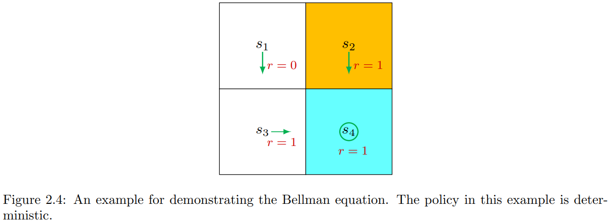
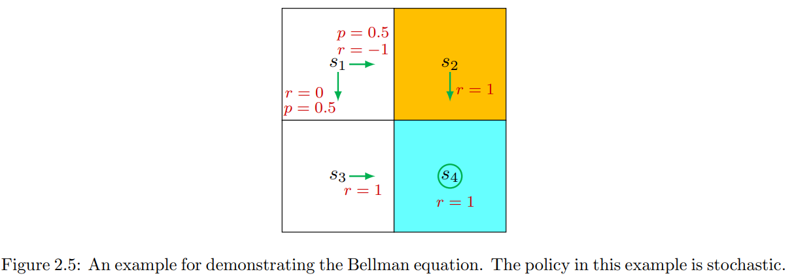
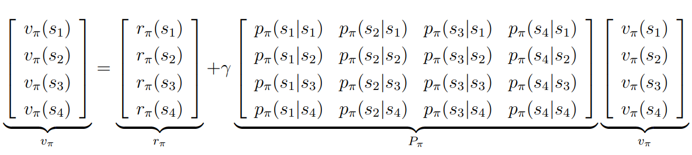
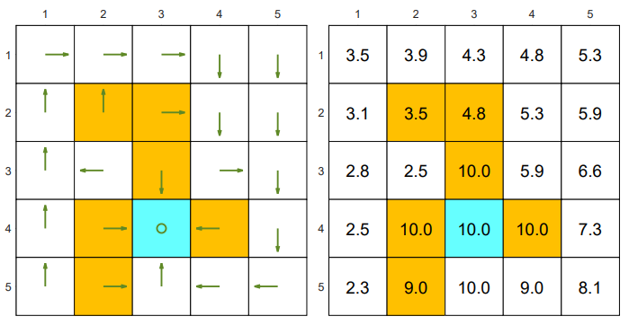

# 状态价值（State Values）和贝尔曼方程（Bellman Equation）

## 状态价值（State Values）

为了介绍状态价值先引入一些符号。

考虑一个时间步骤序列 $t = 0, 1, 2, ...$，在时刻 $t$，Agent 处于状态 $ S_t$，并按照策略 $\pi$ 采取了动作 $A_t$。然后转移到下一个状态 $S_{t+1}$，获得的即时奖励是 $R_{t+1}$。这个过程可以简洁的表示为

$$S_t \xrightarrow{A_t}  S_{t+1},R_{t+1}$$

注意，这里的 $S_t,S_{t+1},A_t,R_{t+1}$ 都是随机变量，而且  $S_t,S_{t+1} \in \mathcal{S}$， $A_t \in \mathcal{A(S_t)}$，$R_{t+1} \in \mathcal{R(S_t, A_t)}$

从 $t$ 时刻开始，可以获得一个 state-action-reward 的轨迹：

$$ S_t \xrightarrow{A_t} S_{t+1},R_{t+1} \xrightarrow{A_{t+1}} S_{t+2},R_{t+2} \xrightarrow{A_{t+2}} S_{t+3},R_{t+3} ... $$

沿着轨迹，获得的折扣回报是从时刻 $t$ 开始的累积折扣奖励：

$$G_t = R_{t+1} + \gamma R_{t+2} + \gamma^2 R_{t+3} + ...$$

$\gamma$ 是折扣因子，$\gamma \in (0, 1) $。

注意，这里的 $R_{t+1}, R_{t+2}, ...$ 都是随机变量，因此 $G_t$ 也是随机变量。

由于 $G_t$ 是随机变量，我们可以计算它的期望值：

$$v_\pi(s) = \mathbb{E}_\pi[G_t|S_t=s]$$

理解为从状态 $s$ 开始，按照策略 $\pi$ 行动，获得的期望回报。

这里 $v_\pi(s)$ 称之为**状态价值函数(state-value function)** 或者 $s$ 的**状态价值(state value)**。

一些重要的说明：
- $v_\pi(s)$ 依赖于 $s$。这是因为它的定义是一个条件期望，条件是 Agent 从 $S_t=s$ 开始。
- $v_\pi(s)$ 依赖于 $\pi$。这是因为轨迹是通过遵循策略 $\pi$ 生成的。对于不同的策略，状态价值可能不同。
- $v_\pi(s)$ 不依赖于 $t$。如果 Agent 在状态空间中移动，$t$ 代表当前时间步。一旦给出策略 $\pi$，其对应的$v_\pi(s)$ 值就确定了，与时刻 $t$ 无关。

### 状态价值与回报之间的关系

当策略和系统模型都是确定的时（采取的策略固定，迁移的状态固定），从某个状态 $s$ 开始总是会有相同的轨迹。在这种情况下，从一个状态 $s$ 开始获得的回报等于该状态的价值。

相比之下，当策略或系统模型中的任何一个都是随机的时，从相同的状态 $s$ 开始可能会生成不同的轨迹。在这种情况下，不同轨迹的回报是不同的，状态价值是这些回报的平均值。

尽管回报可以用来评估策略，但使用状态价值来评估策略更为正式：产生更高状态价值的策略更好。因此，状态价值构成了强化学习中的一个核心概念。

## 贝尔曼方程（Bellman Equation）

接下来推导贝尔曼方程。
首先，我们可以将折扣回报 $G_t$ 重写为：

$$\begin{aligned}
G_t &= R_{t+1} + \gamma R_{t+2} + \gamma^2 R_{t+3} + ... \\
&= R_{t+1} + \gamma(R_{t+2} + \gamma R_{t+3} + \gamma^2 R_{t+4} + ...) \\
&= R_{t+1} + \gamma G_{t+1} \\
\end{aligned}$$

这个等式建立了 $G_t$ 和 $G_{t+1}$之间的关系。表明折扣回报 $G_t$ 可以分解为即时奖励 $R_{t+1}$ 和下一个时刻的折扣回报 $G_{t+1}$ 的加权和。

因此状态价值函数可以被重写为：

$$\begin{aligned}
v_\pi(s) &= \mathbb{E}_\pi[G_t|S_t=s] \\
&= \mathbb{E}_\pi[R_{t+1} + \gamma G_{t+1}|S_t=s] \\
&= \mathbb{E}_\pi[R_{t+1} |S_t=s] +  \gamma \mathbb{E}_\pi[G_{t+1}|S_t=s]
\end{aligned}$$

- 方程的第一项 $\mathbb{E}_\pi[R_{t+1} |S_t=s]$ 是**即时奖励的期望值**。使用全期望定理，可以计算为：
  
  $$\begin{aligned}
  \mathbb{E}_\pi[R_{t+1} |S_t=s] &= \sum_{a \in \mathcal{A}} \pi(a|s) \mathbb{E}_\pi[R_{t+1} |S_t=s, A_t=a] \\
  &= \sum_{a \in \mathcal{A}} \pi(a|s) \sum_{r \in \mathcal{R}} p(r|s,a)r \\
  \end{aligned}$$

  这里 $\mathcal{A}$ 和 $\mathcal{R}$ 分别是所有可能的动作和奖励的集合。需要注意的是，对于不同的状态，$\mathcal{A}$ 可能不同。在这种情况下，$\mathcal{A}$ 应写作 $\mathcal{A(s)}$。同样，$\mathcal{R}$ 也可能依赖于 $(s, a)$。这里省略了 $s$ 或 $(s, a)$ 的依赖。
- 方程的第二项 $\mathbb{E}_\pi[G_{t+1}|S_t=s]$ 是**未来奖励的期望值**。使用全期望定理，可以计算为：
  
  $$\begin{aligned}
  \mathbb{E}_\pi[G_{t+1}|S_t=s] &= \sum_{a \in \mathcal{A}} \pi(a|s) \mathbb{E}_\pi[G_{t+1}|S_t=s, A_t=a] \\
  &= \sum_{a \in \mathcal{A}} \pi(a|s) \sum_{s' \in \mathcal{S}} p(s'|s,a) \mathbb{E}_\pi[G_{t+1}|S_{t+1}=s'] \\
  &= \sum_{a \in \mathcal{A}} \pi(a|s) \sum_{s' \in \mathcal{S}} p(s'|s,a) v_\pi(s')
  \end{aligned}$$

  这里 $\mathcal{S}$ 是所有可能的状态的集合。第二步的转换 $\mathbb{E}_\pi[G_{t+1}|S_t=s, A_t=a, S_{t+1}=s'] = \mathbb{E}_\pi[G_{t+1}|S_{t+1}=s']$ 利用到了马尔可夫性质 。最后一个等式是因为 $\mathbb{E}_\pi[G_{t+1}|S_{t+1}=s']$ 就是状态 $s'$ 的状态价值 $v_\pi(s')$。

将上面两个等式代入到上面的状态价值函数：

$$\begin{aligned}
v_\pi(s) &= \mathbb{E}_\pi[R_{t+1} |S_t=s] +  \gamma \mathbb{E}_\pi[G_{t+1}|S_t=s] \\
&= \sum_{a \in \mathcal{A}} \pi(a|s) \sum_{r \in \mathcal{R}} p(r|s,a)r +  \gamma \sum_{a \in \mathcal{A}} \pi(a|s) \sum_{s' \in \mathcal{S}} p(s'|s,a) v_\pi(s') \\
&= \sum_{a \in \mathcal{A}} \pi(a|s) \left(\sum_{r \in \mathcal{R}} p(r|s,a)r + \gamma \sum_{s' \in \mathcal{S}} p(s'|s,a) v_\pi(s')\right), \forall s \in \mathcal{S}
\end{aligned}$$

这个方程就是**贝尔曼方程（Bellman Equation）**。它描述了状态价值之间的关系。它是设计和分析强化学习算法的基本工具。

方程说明如下：
- $v_\pi(s)$ 和 $v_\pi(s')$ 都是待计算的状态价值。这里可能会感到疑惑，因为一个未知的值 $v_\pi(s)$ 依赖于另外一个未知量 $v_\pi(s')$。这里需要注意的是贝尔曼方程是所有状态的一组线性方程，而不是单个方程。当把所有的方程组合起来，就会清楚如何计算所有的状态价值。
- $\pi(s)$是一个给定的策略。由于状态价值可以用来评估策略，从贝尔曼方程中求解状态价值是一个策略评估的过程，这是许多强化学习算法中的重要过程。
- $p(r|s,a)$ 和 $p(s'|s,a)$ 表示系统模型。这里的计算需要依赖于知道这些系统模型的概率，也就是知道了系统模型（环境）状态迁移的概率和奖励的概率，因此称之为 **model-based** 的强化学习。后面还会介绍 **model-free** 的强化学习方法，**model-free** 的方法不需要事先知道系统模型的这些概率。


## 贝尔曼方程的例子

- 考虑如下图中的网格世界，示例图中的策略是确定性的。



计算状态 $s_1$ 的状态价值 $v_\pi(s_1)$。 

状态 $s_1$ 下只会采取向下的动作 $a_3$，因此：

$\pi(a=a_3|s_1) = 1$
$\pi(a \neq a_3|s_1) = 0$

采取动作 $a_3$ 后的状态迁移概率只会往 $s_3$，因此：

$p(s'=s_3|s_1, a_3) = 1$
$p(s' \neq s_3|s_1, a_3) = 0$

奖励为 0 概率为 1，其他为 0：

$p(r = 0|s_1, a_3) = 1$
$p(r \neq 0|s_1, a_3) = 0$

可以得到 $v_\pi(s_1)$：

$$v_\pi(s_1) = \pi(a=a_3|s_1) ( 0 + \gamma v_\pi(s_3)) = 0 + \gamma v_\pi(s_3) $$

同样可以得到：

$$\begin{aligned}
v_\pi(s_2) &= 1 + \gamma v_\pi(s_4)  \\
v_\pi(s_3) &= 1 + \gamma v_\pi(s_4)  \\
v_\pi(s_4) &= 1 + \gamma v_\pi(s_4)  \\
\end{aligned}$$

通过求解可以得到：

$$ v_\pi(s_4) = 1 + \gamma v_\pi(s_4) $$

$$ v_\pi(s_4) = \frac{1}{1-\gamma} $$

代入得到：

$$ v_\pi(s_2) = v_\pi(s_3) = 1 + \gamma \frac{1}{1-\gamma} = \frac{1}{1-\gamma} $$

$$ v_\pi(s_1) = \gamma \frac{1}{1-\gamma} $$

如果设置 $\gamma = 0.9$，则可以得到：

$$\begin{aligned}
v_\pi(s_4) = v_\pi(s_2) = v_\pi(s_3) = \frac{1}{1-0.9} = 10 \\
v_\pi(s_1) = 0.9 \cdot \frac{1}{1-0.9} = 9 
\end{aligned}$$

- 考虑如下图中的网格世界，图中在状态 $s_1$ 下的策略是随机的。



状态 $s_1$ 下的有 $0.5$ 的概率选择向右，$0.5$ 的概率选择向下，则可以计算得到 $v_\pi(s_1)$：

$$ \begin{aligned}
v_\pi(s_1) &= \pi(a=a_2|s_1) (-1 + \gamma v_\pi(s_2)) + \pi(a=a_3|s_1) (0 + \gamma v_\pi(s_3)) \\
&= 0.5 \cdot (-1 + \gamma v_\pi(s_2)) + 0.5 \cdot  (0 + \gamma v_\pi(s_3)) 
\end{aligned} $$

同样可以得到：

$$\begin{aligned}
v_\pi(s_2) &= 1 + \gamma v_\pi(s_4)  \\
v_\pi(s_3) &= 1 + \gamma v_\pi(s_4)  \\
v_\pi(s_4) &= 1 + \gamma v_\pi(s_4)  \\
\end{aligned}$$

求解以上等式可以得到：

$$ v_\pi(s_4) = 1 + \gamma v_\pi(s_4) $$

$$ v_\pi(s_4) = \frac{1}{1-\gamma} $$

代入得到：

$$ v_\pi(s_2) = v_\pi(s_3) = 1 + \gamma \frac{1}{1-\gamma} = \frac{1}{1-\gamma} $$

$$ v_\pi(s_1) = 0.5 \cdot (-1 + \gamma \frac{1}{1-\gamma}) + 0.5 \cdot (\gamma \frac{1}{1-\gamma}) = -0.5 + \gamma \frac{1}{1-\gamma} $$

如果设置 $\gamma = 0.9$，则可以得到：

$$\begin{aligned}
v_\pi(s_4) = v_\pi(s_2) = v_\pi(s_3) = \frac{1}{1-0.9} = 10 \\
v_\pi(s_1) = -0.5 + 0.9 \cdot \frac{1}{1-0.9} = -0.5 + 9 = 8.5
\end{aligned}$$

通过比较以上两种策略的状态价值，可以看到：

$$ v_{\pi_1}(s_i) \geq v_{\pi_2}(s_i), \quad i=1,2,3,4 $$

表明策略 $1$ 优于策略 $2$。

## 贝尔曼方程的矩阵形式

将原始方程

$$ v_\pi(s) = \sum_{a \in \mathcal{A}} \pi(a|s) \left(\sum_{r \in \mathcal{R}} p(r|s,a)r + \gamma \sum_{s' \in \mathcal{S}} p(s'|s,a) v_\pi(s')\right) $$

改写为

$$ v_\pi(s) = r_\pi(s) + \gamma \sum_{s' \in \mathcal{S}} p(s'|s) v_\pi(s') $$

其中：

$$\begin{aligned}
 r_\pi(s) = \sum_{a \in \mathcal{A}} \pi(a|s) \sum_{r \in \mathcal{R}} p(r|s,a)r \\
p_\pi(s'|s) = \sum_{a \in \mathcal{A}} \pi(a|s)  p(s'|s,a) 
\end{aligned}$$

$r_\pi(s)$ 表示即时奖励的均值，$p(s'|s)$ 表示从状态 $s$ 转移到 $s'$ 下的概率。

假定状态有 $n =|\mathcal{S}| $ 个状态，表示为 $s_i$，其中 $i=1,...n$，则对于每一个 $s_i$

$$ v_\pi(s_i) = r_\pi(s_i) + \gamma \sum_{s_j \in \mathcal{S}} p(s_j|s_i) v_\pi(s_j) $$

定义向量 

$$v_\pi=[v_\pi(s_i), ..., v_\pi(s_n)]^T \in \mathbb{R^n}$$

向量 

$$r_\pi=[r_\pi(s_i), ..., r_\pi(s_n)]^T \in \mathbb{R^n}$$

矩阵 

$$P_\pi \in \mathbb{R^{n \times n}}, \quad [P_\pi]_{ij} = p_\pi(s_j|s_i) $$

则方程可以改写成矩阵-向量的形式：

$$ v_\pi = r_\pi + \gamma P_\pi v_\pi $$

其中矩阵 $P_\pi$ 是一个非负矩阵，同时矩阵中每一行的总和为 $0$。




## 求解贝尔曼方程

### 封闭形式解（Closed-form solution）
通过对矩阵

$$ v_\pi = r_\pi + \gamma P_\pi v_\pi $$ 

求逆可以得到：

$$ v_\pi = (I - \gamma P_\pi)^{-1} r_\pi$$

这个方法需要对矩阵进行求逆，在实际中不太适用。

### 迭代解（Iterative solution）
可以通过如下迭代算法来求解贝尔曼方程：

$$ v_{k+1} = r_\pi + \gamma P_\pi v_k, \quad k=0,1,2,... $$ 

该算法生成一个值序列 $\{ v_0, v_1, v_2, ...\}$，其中 $v_0$ 是一个初始的猜测值。当 $k$ 趋于无穷大时， $v_k$ 趋近于真实的 $v_\pi$ 值：

$$ v_k \rightarrow v_\pi = (I - \gamma P_\pi)^{-1} r_\pi, \quad k \rightarrow  \infty $$

证明参见书中。

#### 示例

这里给出如下示例的贝尔曼方程的迭代求解。



```
import numpy as np

# 定义网格世界的大小和参数
grid_size = (5, 5)
gamma = 0.9  # 折扣因子
reward_default = -1  # 默认奖励（黄色格子或尝试到边界外）
reward_goal = 1  # 蓝色目标格子的奖励
epsilon = 1e-5  # 收敛阈值

# 初始化奖励矩阵
rewards = np.array([
    [0, 0, 0, 0, 0],   # 第一行
    [0, -1, -1, 0, 0], # 第二行
    [0, 0, -1, 0, 0],  # 第三行
    [0, -1, 1, -1, 0], # 第四行
    [0, -1, 0, 0, 0],  # 第五行
])

# 定义动作空间
actions = {
    "up": (-1, 0),
    "down": (1, 0),
    "left": (0, -1),
    "right": (0, 1),
    "stay": (0, 0),
}

# 根据图片定义策略（每个格子对应的动作）
policy = {
    (0, 0): "right", (0, 1): "right", (0, 2): "right", (0, 3): "down", (0, 4): "down",
    (1, 0): "up", (1, 1): "up", (1, 2): "right", (1, 3): "down", (1, 4): "down",
    (2, 0): "up", (2, 1): "left",   (2, 2): "down",   (2, 3): "right", (2, 4): "down",
    (3, 0): "up", (3, 1): "right", (3, 2): "stay",(3, 3): "left",   (3, 4): "down",
    (4, 0): "up", (4, 1): "right",   (4, 2): "up",   (4, 3): "left",     (4, 4): "left",
}

# 初始化价值函数矩阵
value_function = np.zeros(grid_size)

# 辅助函数：获取下一个状态和奖励
def get_next_state_and_reward(state, action):
    i, j = state
    di, dj = actions[action]
    next_i, next_j = i + di, j + dj

    # 检查边界条件，如果越界则保持原地并给予默认奖励
    if next_i < 0 or next_i >= grid_size[0] or next_j < 0 or next_j >= grid_size[1]:
        return state, reward_default

    return (next_i, next_j), rewards[next_i][next_j]

# 贝尔曼方程的迭代求解
def value_iteration():
    global value_function
    while True:
        new_value_function = np.copy(value_function)
        delta = 0
        for i in range(grid_size[0]):
            for j in range(grid_size[1]):
                state = (i, j)
                action = policy[state]  # 根据策略选择动作
                next_state, reward = get_next_state_and_reward(state, action)
                # 更新价值函数
                new_value_function[i][j] = reward + gamma * value_function[next_state]
                # 更新最大变化量
                delta = max(delta, abs(new_value_function[i][j] - value_function[i][j]))

        value_function = new_value_function
        # 如果变化量小于阈值，则认为收敛，退出迭代
        if delta < epsilon:
            break

# 执行价值迭代
value_iteration()

# 输出最终的价值函数矩阵
print("最终的价值函数矩阵：")
print(np.round(value_function, decimals=1))
```

```
最终的价值函数矩阵：
[[ 3.5  3.9  4.3  4.8  5.3]
 [ 3.1  3.5  4.8  5.3  5.9]
 [ 2.8  2.5 10.   5.9  6.6]
 [ 2.5 10.  10.  10.   7.3]
 [ 2.3  9.  10.   9.   8.1]]
```

## 动作价值（action value）

这里引入动作价值函数。一个状态-动作（state-action）对 $(s, a)$ 的动作价值定义为：

$$q_\pi(s,a) = \mathbb{E}_\pi[G_{t}|S_t=s, A_t=a]$$

理解为，在策略 $\pi$ 中某个状态 $s$ 下采取动作 $a$ 获得回报的期望。

值得注意：
- 其中条件 $A_t=a$ 是关键——它表示在状态 $s$ 必须选择动作 $a$，后续动作则按策略 $\pi$ 的概率选择。
- 动作价值函数 $q_\pi(s,a)$ 的计算与策略  $\pi$ 在状态 $s$ 下是否选择 $a$ 无关，其核心是评估“假设第一步选 $a$ 后的期望回报。策略  $\pi$ 的作用仅体现在后续状态的动作选择中。
- $q_\pi(s,a)$ 依赖于状态-动作（state-action）对，而不是只有动作。严格上来讲，应该称之为状态-动作价值。

一个在网格世界里面的采样计算示例，假定要计算策略 $\pi$ 在状态 $s_1$ 下采取动作 $a1$ 的回报期望，则从 $s_1$ 固定采取动作 $a_1$，获得奖励，然后根据策略 $\pi$ 选择后续动作，直到终止状态，得到当前轨迹的回报，如此反复一定的采样次数，获得多个轨迹的回报后取均值。


状态价值和动作价值的关系是什么？

两者之间符合条件期望的性质（通过条件期望的全概率分解）：

$$ \mathbb{E}_\pi[G_{t}|S_t=s] = \sum_{a \in \mathcal{A}}  \pi(a|s) \mathbb{E}_\pi[G_{t}|S_t=s, A_t=a] $$

因此可以得到：

$$ v_\pi(s) = \sum_{a \in \mathcal{A}} \pi(a|s) q_\pi(s,a) $$

可以理解为从状态 $s$ 出发，将所有可能的动作 $a$ 对应的回报期望 $\pi(a|s) \cdot q_\pi(s,a)$ 相加，即得到整体状态价值 $v_\pi(s)$。

另外由于 $v_\pi(s)$ 的等式

$$ v_\pi(s) = \sum_{a \in \mathcal{A}} \pi(a|s) \left(\sum_{r \in \mathcal{R}} p(r|s,a)r + \gamma \sum_{s' \in \mathcal{S}} p(s'|s,a) v_\pi(s')\right) $$

可以得到

$$ q_\pi(s,a) = \sum_{r \in \mathcal{R}} p(r|s,a)r + \gamma \sum_{s' \in \mathcal{S}} p(s'|s,a) v_\pi(s') $$

第一部分是即时奖励的平均值，第二部分是未来奖励的平均值。


## 动作价值的贝尔曼方程

将 

$$ v_\pi(s') = \sum_{a' \in \mathcal{A}} \pi(a'|s') q_\pi(s',a') $$

代入到方程中

$$ q_\pi(s,a) = \sum_{r \in \mathcal{R}} p(r|s,a)r + \gamma \sum_{s' \in \mathcal{S}} p(s'|s,a) v_\pi(s') $$

得到

$$ q_\pi(s,a) = \sum_{r \in \mathcal{R}} p(r|s,a)r + \gamma \sum_{s' \in \mathcal{S}} p(s'|s,a) \sum_{a' \in \mathcal{A(s')}} \pi(a'|s') q_\pi(s',a') $$

这就是动作价值方程。 将所有的方程放到一起，得到矩阵-向量的形式：

$$q_{\pi} = \tilde{r} + \gamma P\Pi q_{\pi} $$

其中 $q_{\pi}$ 动作价值向量，$ [q_{\pi}]_{(s,a)} = q_{\pi}(s,a) $。$\tilde{r}$ 即时奖励向量 $\tilde{r} = \sum_{r \in \mathcal{R}} p(r|s,a)r $。 $P$ 是状态迁移矩阵 $[P]_{(s,a),s'} = p(s'|s,a)$。$\Pi$ 是分块对角矩阵，其中每个分块是一个 $1 × |\mathcal{A}|$ 向量，$\Pi_{s', (s,a)} = \pi(a'|s')$，而 $\Pi$ 的其他项为零。

与基于状态价值定义的贝尔曼方程相比，基于动作价值定义的方程具有一些独特特征。例如，$\tilde{r}$ 和 $P$ 与策略无关，仅由系统模型决定。策略嵌入在 $\Pi$ 中。

## 参考文献
- https://github.com/MathFoundationRL/Book-Mathematical-Foundation-of-Reinforcement-Learning
