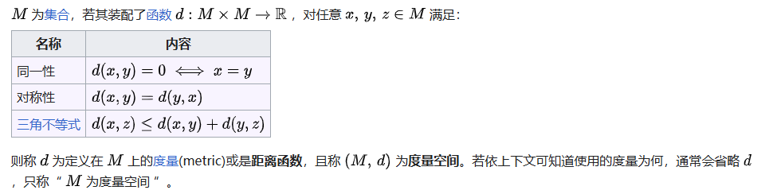

# 最优状态价值和贝尔曼最优方程

强化学习的最终目标是寻求最优策略。因此，有必要定义什么是最优策略。在本章中，我们介绍了一个核心概念和一个重要工具。核心概念是最优状态价值，基于此我们可以定义最优策略。重要工具是贝尔曼最优方程，通过它可以求解最优状态价值和策略。

## 最优策略和最优状态价值

**定义：** **最优策略和最优状态价值 (Optimal policy and optimal state value)**

一个策略 $\pi^*$ 是最优的，那么它对于所有的策略 $\pi$ 在所有的状态 $s$ 下满足:

$$ v_{\pi^*}(s) \geq v_{\pi}(s), \quad \forall s \in \mathcal{S}  $$

则称之为**最优策略**。同时最优策略 $\pi^*$ 的状态价值是**最优状态价值**。

上述定义表明，最优策略相对于所有其他策略，在每个状态下都具有最大的状态价值。这个定义也引发了许多问题：
- 存在：最优策略是否存在？
- 独特性：最优策略是否唯一？
- 随机性：最优策略是随机的还是确定性的？
- 算法：如何获得最优策略和最优状态值？

## 贝尔曼最优方程(Bellman optimality equation)

分析最优策略和最优状态价值的工具是贝尔曼最优方程（Bellman optimality equation, BOE）。通过求解此方程，我们可以获得最优策略和最优状态值。

接下来，我们介绍 BOE 的表达式，然后对其进行详细分析。

$$\begin{aligned}
v(s) =& \max_{\pi(s) \in \Pi(s)} \sum_{a \in \mathcal{A}} \pi(a|s) \left(\sum_{r \in \mathcal{R}} p(r|s,a)r + \gamma \sum_{s' \in \mathcal{S}} p(s'|s,a) v(s')\right) \\
=& \max_{\pi(s) \in \Pi(s)} \sum_{a \in \mathcal{A}} \pi(a|s) q(s,a)
\end{aligned}$$

这里 $\pi(s)$ 表示状态 $s$ 下的策略，$\Pi(s)$ 表示状态 $s$ 下所有可能策略的集合。

$v(s)$ 和 $v(s')$ 都是未知量，同时

$$ q(s,a) = \sum_{r \in \mathcal{R}} p(r|s,a)r + \gamma \sum_{s' \in \mathcal{S}} p(s'|s,a) v(s') $$

我们需要回答关于 BOE 的以下基本问题：
- 存在：这个方程有解吗？
- 独特性：该解决方案是否唯一？
- 算法：如何解这个方程？
- 最优性：解决方案如何与最优策略相关联？

一旦我们能够回答这些问题，我们将清楚地理解最优状态值和最优策略。

### 最大化 BOE 的右边

如何计算右边的最大化的值，通过一个示例来表示：

示例：给定 $q_1, q_2, q_3 \in \mathbb{R}$ ，找到如下等式最大值时的 $c_1,c_2,c_3$：

$$ \sum^3_{i=1} c_i q_i = c_1 q_1 + c_2 q_2 + c_3 q_3  $$

其中 $c_1 + c_2 + c_3 = 1$ 且  $c_1, c_2, c_3 > 0$。

不失一般性，假设 $ q_3 \geq q_1,q_2 $，则最优解为 $c^*_3=1$ 且 $c^*_1=c^*_2=0$，这是由于：

$$ q_3 = (c_1+c_2+c_3)q_3 = c_1 q_3 + c_2 q_3 + c_3 q_3 \geq c_1 q_1 + c_2 q_2 + c_3 q_3, \quad \forall c_1,c_2,c_3 $$

由此我们可以类推，由于 $ \sum_a \pi(a|s) = 1$，则可以得到：

$$ \sum_{a \in \mathcal{A}} \pi(a|s) q_\pi(s,a) \leq \sum_{a \in \mathcal{A}} \pi(a|s) \max_{a \in \mathcal{A}} q_\pi(s,a) = \max_{a \in \mathcal{A}} q_\pi(s,a) $$

当 $\pi(a|s)$ 满足如下条件时，上述等式成立。

$$
\pi(a|s) = 
\begin{cases}
1, & a = a^*, \\
0, & a \neq a^*.
\end{cases}$$

这里的 $a^* = \argmax_a q(s,a)$。

可以理解为，求解得到的最优策略为在状态 $s$ 下选择能够让动作价值 $q_\pi(s,a)$ 最大的动作。

$$v(s) = \max_{\pi(s) \in \Pi(s)} \sum_{a \in \mathcal{A}} \pi(a|s) q(s,a)$$

### BOE 的矩阵-向量形式

BOE 的矩阵-向量形式为：

$$ v = \max_{\pi \in \Pi}( r_\pi + \gamma P_\pi v) $$

其中：

$$\begin{aligned}
v &\in \mathbb{R}^{|\mathcal{S}|} \\
[r_\pi]_s &= \sum_{a \in \mathcal{A}} \pi(a|s) \sum_{r \in \mathcal{R}} p(r|s,a)r \\
[P_\pi]_{s,s'} &= p_\pi(s'|s) = \sum_{a \in \mathcal{A}} \pi(a|s)  p(s'|s,a)
\end{aligned}$$

由于最优策略 $\pi$ 是由 $v$ 来决定，因此，右边可以写成 $v$ 的函数，表示为：

$$ f(v) = \max_{\pi \in \Pi}(r_\pi + \gamma P_\pi v）$$

这样，BOE 就可以用简洁的形式表示为：

$$ v = f(v)$$

### 压缩映射定理（Contraction mapping theorem）

**压缩映射定理（Contraction mapping theorem）**，也被称之为 **Banach 不动点定理**。

为了介绍**压缩映射定理**，展开介绍如下几个基本概念：

#### 度量空间
在数学中，**度量空间（Metric space）** 是具有距离这一个概念的集合，具体来说，是装配了一个称为度量的函数，用以表示此集合中任两个成员间的距离。

度量空间中最符合人们对于现实直观理解的为三维欧几里得空间。事实上，“度量”的概念即是欧几里得距离四个周知的性质之推广。欧几里得度量定义了两点间之距离为连接这两点的直线段之长度。定义如下：

#### 压缩映射
设 $(X,d)$ 为非空的度量空间，对于映射 $T: X \rightarrow X$，如果存在 $q \in (0,1)$ 使得 

$$d(T(x), T(y)) < q \cdot d(x,y), \forall x,y \in X $$

那么映射 $T$ 称之为**压缩映射**。从直观上理解，一个压缩映射 $T$，使得 $T(x)$ 和 $T(y)$ 之间的距离比 $x$ 和 $y$ 之间的距离近。

#### 压缩映射定理（巴拿赫不动点定理）

一个映射 $T: X \rightarrow X$ 是一个压缩映射，则 $T$ 在 $X$ 内**有且只有**一个**不动点 $x^*$**，也就是：

$$ T(x^*) = x^*$$

而且这个不动点可以用如下迭代的方式求出：

从 $X$ 内的任意一个元素 $x_0$ 开始，定义一个迭代序列 $x_n = T(x_{n-1})$，其中 $n=1,2,3,...$，那么这个序列收敛，并且收敛的极限为 $x^*$。以下的不等式描述了收敛的速度：

$$ d(x^*, x_n) \leq \frac{q^n}{1-q} d(x_1, x_0) $$

等价地：

$$ d(x^*, x_{n+1}) \leq \frac{q}{1-q} d(x_{n+1}, x_{n}) $$

且

$$ d(x^*, x_{n+1}) \leq q \cdot d(x^*, x_{n}) $$

满足以上不等式的最小的 $q$ 有时称为**利普希茨常数**。
这个序列也是柯西序列。在数学中，**柯西序列（Cauchy sequence）**，也称为基本列，是指一个元素随着序数的增加而愈发靠近的数列。

书中用一个向量或矩阵的范数（norm，包括 L1,L2 等）表示距离：

$$ \|f(x_1) - f(x_2)\| \leq \gamma\|x_1 - x_2\| $$

其中  $ x_1, x_2 \in \mathbb{R}^d$。

#### 举例

这里举两个例子

- $x = f(x) = 0.5 x + 3, x \in \mathbb{R} $
  那么 $x=6$ 是不动点，由于 $ 0.5 \cdot 6 + 3 = 6$。$f(x) = 0.5x + 3$ 是一个压缩映射，可以得到
  
  $$ \| f(x_1) - f(x_2) \| = \|0.5 x_1 - 0.5 x_2\| = 0.5 \| x_1 - x_2 \|  \leq \gamma\|x_1 - x_2\|, r \in [0.5, 1) $$

- $x = f(x) = Ax$， 其中 $x \in \mathbb{R}^n, A \in \mathbb{R}^{n \times n}$，且 $ \| A \| \leq r \lt 1 $。
  其中 $ \| A \| $ 表示矩阵的范数，任何满足范数公理的矩阵范数都可以使用。
  同样可以得到 $x = 0$ 是不动点，由于 $ A \cdot 0 = 0$。具备压缩映射性质

  $$ \|A x_1 - A x_2\| = \| A(x_1 - x_2) \|  \leq \|A\| \|x_1 - x_2\| \leq r  \|x_1 - x_2\|$$

### BOE 右侧的压缩属性

**定理**：BOE 右侧的函数 $f(v)$ 是一个压缩映射。特别地，对于任意的 $v_1, v_2 \in \mathbb{R}^{|S|}$，有：

$$ \|f(v_1) -f(v_2)\|_{\infin} \leq r \| v_1 - v_2 \| $$ 

其中 $ r \in (0,1) $ 是折扣因子，$ \|\cdot\|_{\infin}$ 是最大范数，即向量每个元素的绝对值的最大值。

证明参见书中。

**值得注意**的是贝尔曼方程的右侧也是一个压缩映射。

$$ v_\pi(s) = r_\pi(s) + \gamma \sum_{s' \in \mathcal{S}} p(s'|s) v_\pi(s') $$

也就是

$$ f_\pi(v(s)) = r_\pi(s) + \gamma \sum_{s' \in \mathcal{S}} p(s'|s) v_\pi(s') $$

根据压缩映射定理可以通过迭代的方式求得 **不动点 $v_\pi$**。

## 从 BOE 中求解最优策略

下面介绍如何求解 BOE 来获得最优状态价值 $v^*$ 和最优策略 $\pi^*$。

### 求解 $v^*$

如果 $v^*$ 是 BOE 的解，那么它满足：

$$ v^* = \max_{\pi \in \Pi}(r_\pi + \gamma P_\pi v^*） $$

因此 $v^*$ 是一个不动点，因此可以用压缩映射来得到如下定理。

**定理**：（存在性，唯一性和算法）对于 BOE $v = f(v) = \max_{\pi \in \Pi}(r_\pi + \gamma P_\pi v^*）$ 总是存在一个唯一解 $v^*$，并且可以通过如下迭代的方式求解：

$$v_{k+1} = f(v_k) = \max_{\pi \in \Pi}(r_\pi + \gamma P_\pi v_k), \quad k=0,1,2,...$$

对于任意给定的 $v_0$，当 $k \rightarrow \infin $ 时，$v_k$ 以指数级快速收敛到 $v^*$。

该定理的证明直接来自压缩映射定理。该定理表明了 BOE 的解的存在性，唯一性和求解的迭代算法。

### 求解 $\pi^*$

一旦得到 $v^*$，我们可以很容易通过求解如下式子来得到 $\pi_*$：

$$ \pi^* =  \argmax_{\pi \in \Pi}(r_\pi + \gamma P_\pi v^*)$$

将上式代入到 BOE 得到：

$$ v^* =  r_{\pi^*} + \gamma P_{\pi^*} v^* $$

因此 $v^* = v_{\pi^*}$ 是策略 $\pi^*$ 的状态价值。BOE 是一个特殊的贝尔曼方程，其对应的策略为 $\pi^*$。

### $v^*$ 和 $\pi^*$ 的最优性

**定理**：BOE 的解 $v^*$ 是最优状态价值，$\pi^*$ 是最优策略。因此，对任意一个策略 $\pi$，都有：

$$ v^* = v_{\pi^*} \leq v_\pi $$

其中 $v_\pi$ 是策略 $\pi$ 的状态价值，$\leq$ 是逐个元素比较。 证明参见书中。

### 贪婪最优策略（Greedy optimal policy）

**定理**：对于任意状态 $s \in S$ ，如下确定性的贪婪策略：

$$
\pi^*(a|s) = 
\begin{cases}
1, & a = a^*(s), \\
0, & a \neq a^*(s).
\end{cases}$$

是求解 BOE 的一个最优策略。这里 

$$ a^* = \argmax_a q^*(a, s)$$

其中 

$$ q^*(s,a) = \sum_{r \in \mathcal{R}} p(r|s,a)r + \gamma \sum_{s' \in \mathcal{S}} p(s'|s,a) v^*(s') $$

该策略称之为贪婪策略是由于它每次都采取具有最大 $q^*(s,a)$ 的动作。

该策略有两个重要性质。

- 最优策略的不唯一性：虽然 $v^*$ 的值是唯一的，但是其对应的最优策略不一定唯一。如下图所示。
- 最优策略的随机性：最优策略可以是随机的，也可以是确定性的。不过，根据定理，可以确定总是存在一个确定性的策略。

## 影响最优策略的因素

下面我们通过 BOE 来研究哪些因素会影响最优策略。

$$\begin{aligned}
v(s) =& \max_{\pi(s) \in \Pi(s)} \sum_{a \in \mathcal{A}} \pi(a|s) \left(\sum_{r \in \mathcal{R}} p(r|s,a)r + \gamma \sum_{s' \in \mathcal{S}} p(s'|s,a) v(s')\right), \quad s \in S 
\end{aligned}$$

通过观察以上式子，可以得到最优状态价值和最优策略由如下参数决定：

- 即时奖励 $r$
- 折扣因子 $\gamma$
- 系统模型 $p(r|s,a), p(s'|s,a)$

在系统模型固定的情况下，讨论当改变 $r$ 和 $\gamma$ 的值时，最优策略是如何变化的。

### 基线例子

奖励设置为 $r_{boundary} = r_{forbidden} = -1$， $r_{target} = 1$，其他 $r_{other} = 0$。折扣因子 $\gamma = 0.9$。

上图中给出了最优策略和最优状态价值。有趣的是，Agent 并不惧怕穿越禁区来到达目标区域。比如，从 (row=4, column=1) 处的状态开始，Agent 有两种到达目标区域的选择。第一种选择是避开所有禁区并经过很长的距离到达目标区域。第二种选择是穿越禁区。虽然 Agent 在进入禁区时会获得负奖励，但第二条轨迹的累积奖励大于第一条轨迹。因此，由于 $\gamma$ 值相对较大，最优策略具有远见（far-sighted）。

### 折扣因子的影响

如果将折扣因子从 $\gamma = 0.9$ 改为 $\gamma = 0.5$，同时保持其他参数不变，则最优策略将变成下图所示的策略。有趣的是，Agent 不再敢冒险。相反，它会长途跋涉到达目标，同时避开所有禁区。这是因为 $\gamma = 0.5$ 值相对较小，最优策略变得目光短浅（short-sighted）。

在 $\gamma = 0$ 的极端情况下，对应的最优策略如下图所示。在这种情况下，Agent 无法到达目标区域。这是因为每个状态的最优策略都是极其短视的，仅仅选择具有最大即时奖励的动作，而不是最大的总回报。

### 奖励值的影响

如果我们想严格禁止 Agent 进入任何禁区，可以增加这样做所受到的惩罚。例如，如果 $r_{forbidden}$ 从 $-1$ 变为 $-10$，则最终的最优策略可以避开所有禁区，如下图所示。

然而，改变奖励并不总是会导致不同的最优策略。

一个重要的事实是，最优策略对奖励的仿射变换具有不变性。换句话说，如果我们缩放所有奖励或为所有奖励添加相同的值，最优策略将保持不变。

### 最优策略不变性

**定理**：考虑一个马尔可夫决策过程，其中 $v^* \in \mathbb{R}^{|S|}$，最优状态价值满足 $v^* = \max_{\pi \in \Pi}(r_\pi + \gamma P_\pi v^*）$。如果每个奖励 $\gamma \in R$ 通过仿射变换变为 $\alpha\gamma + \beta $，其中 $\alpha, \beta \in \mathbb{R}$ 且 $\alpha \gt 0$，则相应的最优状态价值也是 $v^*$ 的仿射变换：

$$v' = \alpha v^* + \frac{\beta}{1-\gamma} \cdot 1$$

其中，$\gamma \in (0,1)$ 是折扣因子，$ 1= [1,...,1]^T$。因此从 $v'$ 中推导出来的最优策略相对于奖励的仿射变换保持不变。

### 避免无意义的弯路

在奖励设置中，Agent 每移动一步都会获得 $r = 0$ 的奖励（除非它进入禁区或目标区域，或试图越过边界）。既然零奖励不是惩罚，那么最优策略是否会在到达目标之前走毫无意义的弯路？我们是否应该将 $r$ 设置为负数，以鼓励 Agent 尽快到达目标？

答案是不需要。

考虑如下场景：

其中右下角的单元格是目标区域。在 $s_2$，策略 $\pi_a$  是向下移动，策略 $\pi_b$ 是向左移动。

第二条策略在到达目标区域之前绕了一段路。如果我们只考虑即时奖励，那么绕这条路并不重要，因为不会获得负的即时奖励。但是，如果我们考虑折扣回报，那么这条路就很重要了。

$$return_{\pi_a} = 1 + \gamma 1 + \gamma^21+... = \frac{1}{1-\gamma} = 10 $$

$$return_{\pi_b} = 0 + \gamma 0 + \gamma^21+... = \frac{\gamma^2}{1-\gamma} = 8.1 $$

显然，轨迹越短，回报越大。因此，虽然每一步的即时奖励不会鼓励 Agent 尽快接近目标，但折扣因子会鼓励它这样做。

## 参考文献
- https://zh.wikipedia.org/wiki/%E5%8E%8B%E7%BC%A9%E6%98%A0%E5%B0%84
- https://zh.wikipedia.org/wiki/%E5%BA%A6%E9%87%8F%E7%A9%BA%E9%97%B4
- https://zhuanlan.zhihu.com/p/494932745
- https://zh.wikipedia.org/wiki/%E6%9F%AF%E8%A5%BF%E5%BA%8F%E5%88%97