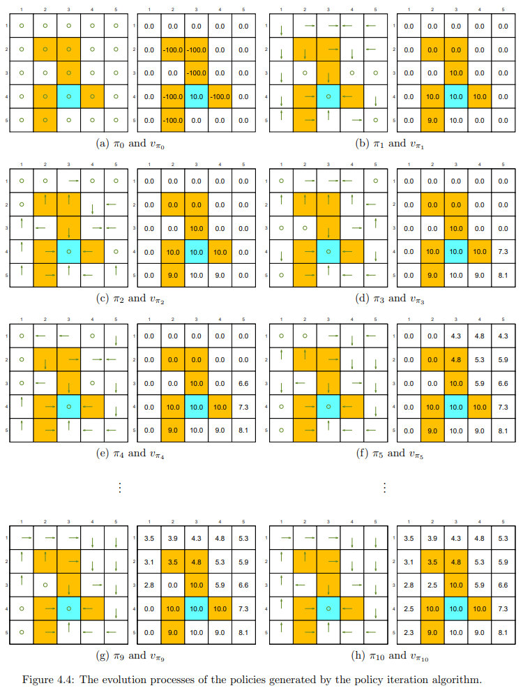

# 价值迭代和策略迭代

本章将介绍三个算法，分别是价值迭代（value iteration）算法，策略迭代（policy
iteration）算法和截断策略迭代（ truncated policy iteration）算法。

本章介绍的算法称为动态规划（dynamic programming）算法，需要系统模型。

## 价值迭代（value iteration）

### 矩阵向量的形式

算法是通过压缩映射定理的迭代的方式来求解贝尔曼最优方程：

$$v_{k+1} = \max_{\pi \in \Pi}(r_\pi + \gamma P_\pi v_k), \quad k=0,1,2,...$$

对于任意给定的 $v_0$，当 $k \rightarrow \infin $ 时，$v_k$ 和 $\pi_k$ 分别收敛到最优状态价值和最优策略。

算法在每次迭代时都有两个步骤。

#### 1. 策略更新（policy update）

目标是找到可以解决以下优化问题的策略：

$$\pi_{k+1} = \argmax_{\pi}(r_\pi + \gamma P_\pi v_k)$$

这里的 $v_k$ 是在上一次迭代中获得的。特别的，$v_0$ 是初始化时的值。

#### 2. 价值更新（value update）

通过如下方式计算新的 $v_{k+1}$：

$$v_{k+1} = r_{\pi_{k+1}} + \gamma P_{\pi_{k+1}} v_k$$

计算出来的 $v_{k+1}$ 被用到下一次迭代中。

### 逐个元素的形式

考虑步骤 $k$ 和状态 $s$：

#### 1. 策略更新步骤（policy update step）

逐个元素形式的策略更新步骤为：

$$ \pi_{k+1}(s) = \argmax_{\pi(s)} \sum_{a \in \mathcal{A}} \pi(a|s) \left(\sum_{r \in \mathcal{R}} p(r|s,a)r + \gamma \sum_{s' \in \mathcal{S}} p(s'|s,a) v_k(s')\right), \forall s \in S$$

解决上述最优化问题的最优策略为：

$$
\pi_{k+1}(a|s) = 
\begin{cases}
1, & a = a^*_k(s), \\
0, & a \neq a^*_k(s).
\end{cases}$$

这里的 $a^*_k(s) = \argmax_a q_k(s,a)$。如果 $\argmax_a q_k(s,a)$ 有多个解的话，可以从中选择任意一个。这样选择出来的策略称之为为贪心策略。

#### 2. 价值更新步骤（value update step）

逐个元素形式的价值更新步骤为：

$$ v_{k+1}(s) = \sum_{a \in \mathcal{A}} \pi_{k+1}(a|s) \left(\sum_{r \in \mathcal{R}} p(r|s,a)r + \gamma \sum_{s' \in \mathcal{S}} p(s'|s,a) v_k(s')\right), \forall s \in S$$

替换 $\pi_{k+1}(a|s)$ 为上一个步骤得到的贪心策略，则得到：

$$ v_{k+1}(s) = \max_a q_k(s,a)$$

### 算法步骤

上述的步骤可以描述为：

$$ v_k(s) \rightarrow q_k(s,a) \rightarrow new\ greedy\ policy\ \pi_{k+1}(s) \rightarrow new\ value\ v_{k+1}(s) = \max_aq_k(s,a)$$

具体算法步骤如下图

### 示例说明

使用如下 $2 \times 2$ 的网格世界来做示例。

目标是 $s4$，即时奖励 $r_{boundary} = r_{forbidden} = -1$， $r_{target} = 1$，其他 $r_{other} = 0$。折扣因子 $\gamma = 0.9$。

#### 步骤 $k=0$

不失一般性，设置初始状态价值 $v_0(s_1) = v_0(s_2)= v_0(s_3) = v_0(s_4) =0$。

- 计算动作价值 $q_0(s,a)$：

  

  将 $v_0(s_1) = v_0(s_2)= v_0(s_3) = v_0(s_4) =0$ 代入得到：

  

- 策略更新
  策略 $\pi_1$ 是对每个状态 $s$ 选择最大 $q(s,a)$ 的动作，因此得到

  $$ \pi_1(a_5|s_1) = 1, \pi_1(a_3|s_2) = 1, \pi_1(a_2|s_3) = 1, \pi_1(a_5|s_4) = 1 $$

  其中 $\pi_1(a_5|s_1)$ 是随机选择的，假定这里选 $a_5$。

- 价值更新
  价值 $v_1$ 的获得是通过对每一个状态 $s$ 的状态价值更新为最大的 $q(s,a)$。因此得到：

  $$ v_1(s_1) = 0,\ v_1(s_2) = 1,\ v_1(s_3) = 1,\ v_1(s_4) = 1 $$

#### 步骤 $k=1$

- 计算动作价值 $q_1(s,a)$：
  
  将上个步骤得到的 $v_1$ 代入到上面的 q-table 表 4.1 中可以得到：

  

- 策略更新
  策略 $\pi_2$ 是对每个状态 $s$ 选择最大 $q(s,a)$ 的动作，因此得到

  $$ \pi_2(a_3|s_1) = 1,\ \pi_2(a_3|s_2) = 1,\ \pi_2(a_2|s_3) = 1,\ \pi_2(a_5|s_4) = 1 $$

- 价值更新
  价值 $v_2$ 的获得是通过对每一个状态 $s$ 的状态价值更新为最大的 $q(s,a)$。因此得到：

  $$ v_2(s_1) = \gamma 1,\ v_2(s_2) = 1+\gamma 1,\ v_2(s_3) = 1+\gamma1,\ v_2(s_4) = 1+\gamma 1 $$

可以看到策略 $\pi_2$ 已经是最优策略。

## 策略迭代（Policy iteration）

与价值迭代不同，策略迭代不是为了直接求解贝尔曼最优方程。但是，它与价值迭代有着密切的关系。

### 矩阵向量的形式

每个迭代有两个步骤。

#### 1. 策略评估（policy evaluation）

这个步骤是评估一个给定的策略，计算其对应的状态价值。也就是求解如下贝尔曼方程：

$$ v_{\pi_k} = r_{\pi_k} + \gamma P_{\pi_k} v_{\pi_k} $$ 

这里 $\pi_k$ 是上一轮迭代得到的策略。$v_{\pi_k}$ 是该策略的状态价值。$r_{\pi_k}$ 和 $P_{\pi_k}$ 来自系统模型。

#### 2. 策略改进（policy improvement）

这个步骤是对策略进行改进。上个步骤中的 $v_{\pi_k}$ 计算出来后，可以通过如下的方式得到新的策略 $\pi_{k+1}$：

$$ \pi_{k+1}= \argmax_\pi (r_{\pi} + \gamma P_{\pi} v_{\pi_k}) $$ 

### 逐个元素的形式

#### 1. 策略评估（policy evaluation）

通过如下逐个元素迭代的方式来从 $ v_{\pi_k} = r_{\pi_k} + \gamma P_{\pi_k} v_{\pi_k} $ 中求解 $v_{\pi_k}$ 

$$ v^{j+1}_{\pi_k}(s) = \sum_{a} \pi_k(a|s) \left(\sum_{r} p(r|s,a)r + \gamma \sum_{s'} p(s'|s,a) v^{(j)}_{\pi_k}(s')\right), \forall s \in S $$

这里 $j=0,1,2,...$

#### 2. 策略改进（policy improvement）

这个步骤是对策略进行改进。逐个元素的形式为：

$$ \pi_{k+1}(s) = \argmax_\pi \sum_{a} \pi(a|s) \left(\sum_{r} p(r|s,a)r + \gamma \sum_{s'} p(s'|s,a) v_{\pi_k}(s')\right), \forall s \in S $$

括号中为 $q_{\pi_k}(s,a)$，是策略 $\pi_k$ 的动作价值。

$$ q_{\pi_k}(s,a) = \sum_{r} p(r|s,a)r + \gamma \sum_{s'} p(s'|s,a) v_{\pi_k}(s') $$

令 $ a^*_k(s) = \argmax_a q_{\pi_k}(s,a)$，因此得到贪心最优策略：

$$
\pi_{k+1}(a|s) = 
\begin{cases}
1, & a = a^*_k(s), \\
0, & a \neq a^*_k(s).
\end{cases}$$

### 算法步骤

算法步骤如下图：

从图中可以看出，整个迭代的步骤中嵌套了一个 **Policy evaluation** 步骤也是一个迭代的过程。

**Policy evaluation** 的迭代步骤其实就是第二章中状态价值贝尔曼方程的迭代过程。

### 示例说明

给定一个 $ 5\times 5 $ 的网格世界，目标是 $(4,3)$，即时奖励 $r_{boundary} = -1$, $r_{forbidden} = -10$， $r_{target} = 1$，其他 $r_{other} = 0$。折扣因子 $\gamma = 0.9$。

策略迭代算法可以从初始的随机策略，最终收敛到最优策略。

在迭代过程中观察到两个有趣的现象。
- 靠近目标区域的状态比远离目标区域的状态更早找到最优策略。只有当比较靠近的状态能够首先找到到达目标的轨迹时，较远的状态才能找到通过靠近的状态到达目标的轨迹。
- 状态价值的分布表现出一个有趣的模式：距离目标更近的状态具有更大的状态价值。这种模式的原因是，从更远的状态开始的 Agent 必须经过许多步骤才能获得正奖励，而且奖励将严重折扣，因此相对较小。

## 截断策略迭代（Truncated policy iteration）

接下来，我们介绍一种更通用的算法，称为截断策略迭代（Truncated policy iteration）。

比较上面的迭代算法，可以看到，价值迭代其实就是 $j_{truncate} = 1$ 的情况，策略迭代就是 $j_{truncated} = \infin $ 的情况。因此价值迭代和策略迭代算法是截断策略迭代算法的两种特殊情况。