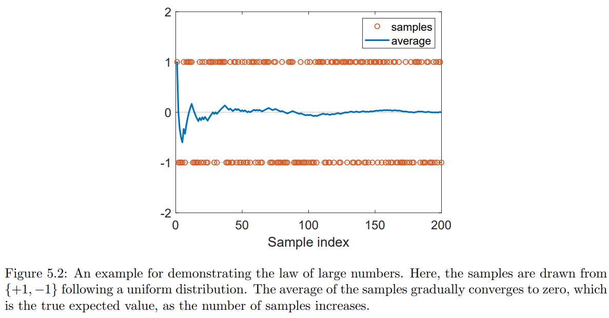
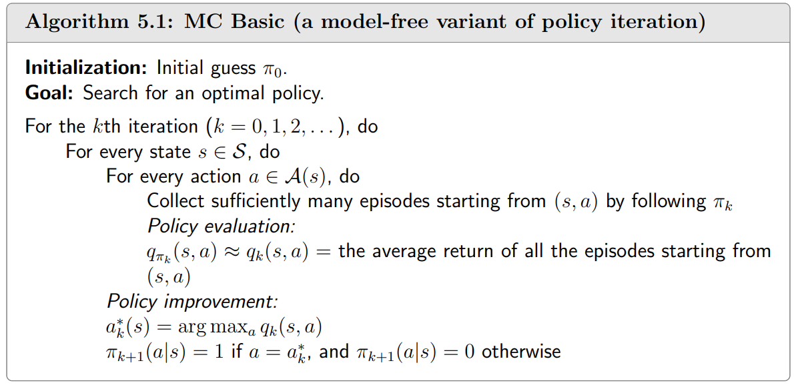
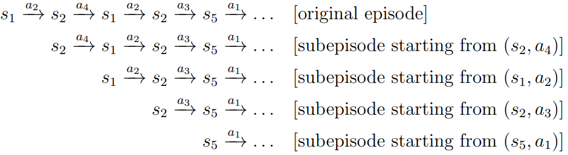
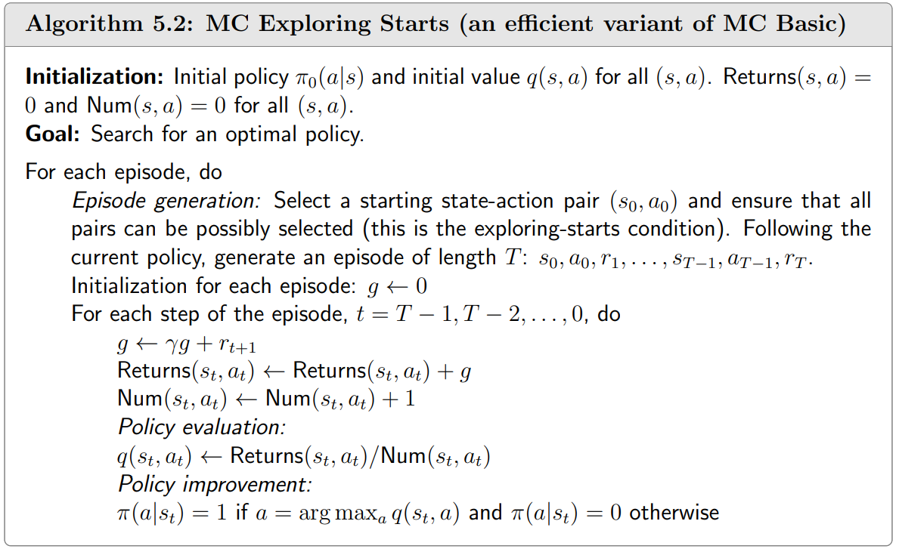
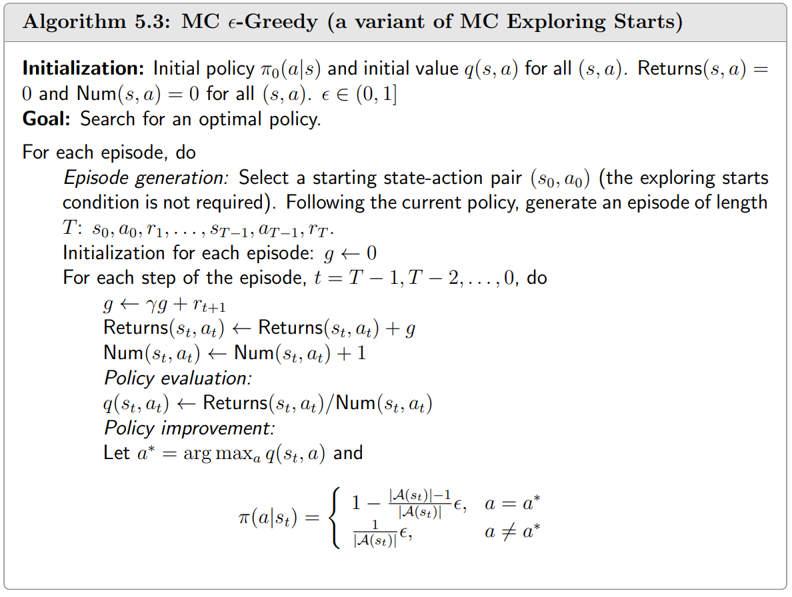

# 蒙特卡洛方法（Monte Carlo Methods）

之前的章节介绍了基于系统模型来找到最优策略的算法。在这个章节中，我们开始介绍 `model-free` 的强化学习算法。

但我们必须填补一个知识空白：我们如何在没有模型的情况下找到最优策略？

理念很简单：如果我们没有模型，我们必须有一些数据。如果我们没有数据，我们必须有一个模型。如果我们两者都没有，那么我们就无法找到最佳策略。强化学习中的“数据”通常是指智能体与环境的交互经验。

## 均值估计（Mean estimation）

考虑一个随机变量 $X$，它可以从表示为 $\mathcal{X}$ 的有限实数集中获取值。假定我们的任务是计算 $X$ 的平均值或期望： $E[X]$。有两种办法来计算 $E[X]$。

### model-based 的方法

这里的模型是指随机变量 $X$ 的概率分布。如果 $X$ 的概率分布是已知的，那么可以基于期望的定义直接计算出均值：

$$ E[X] = \sum_{x \in \mathcal{X}} p(x) \cdot x$$

在本书中，我们交替使用术语期望值、平均值。

### model-free 的方法

如果随机变量 $X$ 的概率分布是未知的，假定我们有一些 $X$ 的样本 ${x_1, x_2, ..., x_n}$，然后均值可以近似为

$$ E[X] \approx \bar{x} = \frac{1}{n} \sum^n_{j=1} x_j$$

当 $n$ 比较小的时候，近似值可能不准。但是，随着 $n$ 的增加，近似值变得越来越准确。当 $ n \rightarrow \infin $ 时，我们有 $ \bar{x} \rightarrow E[X] $。

这个是大数定律（law of large numbers）保证的：大量样本的均值接近期望值。

### 示例 

考虑一个掷硬币的游戏，让随机变量 $X$ 表示落地时表示哪一面。

则随机变量 $X$ 有两种可能： $X=1$ 时显示正面，$X=-1$ 时显示反面。

假定 $X$ 的真实概率分布（即模型）为

$$ p(X=1) = 0.5, \ p(X=-1) = 0.5 $$

如果概率分布式是已知的，则可以直接计算出平均值：

$$ E[X] = 0.5 \cdot 1 + 0.5 \cdot -1 = 0$$

假如概率分布未知，那么我们可以多次抛硬币并记录抽样结果 $ \{x_i\} ^n_{i=1}$。通过计算抽样的平均值，我们可以获得平均值的估计值。如下图所示，随着样本数量的增加，估计的平均值变得越来越准确。

值得一提的是，用于均值估计的样本必须是独立同分布的（i.i.d.）。否则，如果采样值相关，则可能无法正确估计预期值。

## MC Basic：最简单的 MC-based 算法

将策略迭代（policy iteration）转换为 `model-free` 的算法。

回顾策略迭代算法，包含两个步骤，1. 策略评估（policy evaluation），即通过逐个元素迭代的方式来从 $ v_{\pi_k} = r_{\pi_k} + \gamma P_{\pi_k} v_{\pi_k} $ 中求解 $v_{\pi_k}$；2. 策略改进（policy improvement），旨在计算贪婪策略 $ \pi_{k+1}= \argmax_\pi (r_{\pi} + \gamma P_{\pi} v_{\pi_k}) $，逐个元素的形式为：

$$\begin{aligned}
\pi_{k+1}(s) &= \argmax_\pi \sum_{a} \pi(a|s) \left[\sum_{r} p(r|s,a)r + \gamma \sum_{s'} p(s'|s,a) v_{\pi_k}(s')\right] \\
&= \argmax_\pi \sum_{a} \pi(a|s) q_{\pi_k}(s,a)，\forall s \in S
\end{aligned}$$

在策略迭代（policy iteration）的步骤中，第一步策略评估（policy evaluation）中求解 $v_{\pi_k}$ 的目的是为了计算第二步中的 $q_{\pi_k}(s,a)$ 来做基础。在 `model-based` 的方法中，必须要有 $v_{\pi_k}(s')$ 来计算 $q_{\pi_k}(s,a)$。但是在 `model-free` 的方法中，可以不需要 $v_{\pi_k}(s')$，直接通过采样的方法得到 $q_{\pi_k}(s,a)$ 的估计值。

### model-based 的方法

如之前所述，先通过求解贝尔曼方程来计算出 $v_{\pi_k}(s')$，然后计算得到动作价值 $q_{\pi_k}(s,a)$

$$ q_{\pi_k}(s,a) = \sum_{r} p(r|s,a)r + \gamma \sum_{s'} p(s'|s,a) v_{\pi_k}(s') $$

这里需要知道系统模型 $p(r|s,a), p(s'|s,a)$。

### model-free 的方法

回想一下，动作价值的定义是

$$\begin{aligned}
q_\pi(s,a) &= \mathbb{E}_\pi[G_{t}|S_t=s, A_t=a] \\
&= \mathbb{E}_\pi[R_{t+1} + \gamma R_{t+2} + \gamma^2 R_{t+3} +...|S_t=s, A_t=a] \\
\end{aligned}$$

也就是从动作 $(s,a)$ 开始时获得的期望回报。由于 $q_\pi(s,a)$ 是一个期望值，因此可以用 MC 方法来估计。

从 $(s,a)$ 开始，Agent 按照策略 $\pi$ 和环境进行互动，从而得到一定数量的回合（episode）样本。假定有 $n$ 个回合，其中第 $i\th$ 回合的回报为 $g^{(i)}_{\pi_k}(s,a)$，则 $q_\pi(s,a)$ 可以近似为：

$$ q_\pi(s,a) = \mathbb{E}_\pi[G_{t}|S_t=s, A_t=a] \approx \frac{1}{n} \sum^n_{i=1} g^{(i)}_{\pi_k}(s,a)  $$

如果 $n$ 足够大，那么根据大数定律，近似值将足够准确。

基于 MC 的强化学习的基本思想是使用 `model-free` 的方法来估计动作值，以取代策略迭代算法中 `model-based` 的方法。

### MC Basic 算法

这里介绍第一个 MC-based 强化学习方法。

从初始策略 $\pi_0$ 开始，该算法在第 $k\th$ 次迭代中有两个步骤：

#### Step 1: 策略评估（Policy evaluation）

这个步骤是对所有的 $(s,a)$ 评估 $q_{\pi_k}(s,a)$。具体地，我们对于所有的 $(s,a)$ 收集足够多的回合，然后用回报的平均值 $q_{k}(s,a)$ 来近似估计 $q_{\pi_k}(s,a)$。

#### Step 2: 策略改进（Policy improvement）

这个步骤是对所有的 $s$，求解 $ \pi_{k+1}(s)=\argmax_\pi \sum_{a} \pi(a|s) q_{k}(s,a)$。贪婪最优策略为 

$$
\pi_{k+1}(a|s) = 
\begin{cases}
1, & a = a^*_k(s), \\
0, & a \neq a^*_k(s).
\end{cases}$$

这里的 $a^*_k(s) = \argmax_a q_k(s,a)$。

伪代码算法如下：

但是 MC Basic 由于比较低的采样效率，过于简单而不实用。

## MC Exploring Starts

接下来，我们扩展了 MC Basic 算法，以获得另一种基于 MC 的强化学习算法，该算法稍微复杂一些，但采样效率更高。

基于 MC 的强化学习的一个重要方面是如何更有效地使用样本。具体来说，假设我们有一个回合通过遵循策略 $\pi$ 获得的样本：

$$ s_1 \xrightarrow{a_2} s_2 \xrightarrow{a_4} s_1 \xrightarrow{a_2} s_2 \xrightarrow{a_3} s_5 \xrightarrow{a_1} ... $$

每次在一个回合中出现 state-action 对时，称为对该 state-action 对的访问（visit）。可以采用不同的策略来利用这些 state-action 对。

### initial visit

第一个也是最简单的策略是使用初次访问（initial visit）。也就是说，仅使用一个回合中初始 state-action 对来估计其对应的动作价值。对于上面的示例，初始访问策略仅使用该回合来估计 $(s_1,a_2)$ 的动作价值。

但是这样的方式无法有效的使用样本，因为一个回合也访问了其他的状态-动作对，比如 $(s_2,a_4), (s_1,a_2), (s_5,a_1)$。我们可以把一个回合拆解为多个子回合。

状态-动作对访问后生成的轨迹可以被视为一个新的回合。这些新回合可用于估算更多动作价值。这样，可以更有效地利用回合中的样本。

### first-visit

状态-作对可能会在一次回合中被多次访问。例如，$(s_1, a_2)$ 在一个回合中被访问了两次。如果我们只计算首次被访问的情况，则称为 `first-visit` 策略。

### every-visit

如果我们计算 state-action 对的每次访问的情况，这样的策略称为 `every-visit`。

### 算法描述

因此，得到如下 `MC Exploring Starts` 策略：

`MC Exploring Statts` 策略可以避免 Agent 必须等到收集完所有回合后才能更新估计值，就是使用单个回合的回报来近似相应的动作价值。这样，当我们采集到一个回合的样本后，我们可以立即获得一个粗略的估计。然后，可以逐个回合地改进策略。

但是 `exploring starts` 条件需要从每个 state-action 对开始的足够多的回合。只有对每一个状态-动作对都进行了很好的探索，我们才能准确估计它们的动作价值（根据大数定律），从而成功找到最优策略。但是，在实际中很难满足此条件，尤其是那些涉及与环境物理交互的应用程序。

## MC $\epsilon$-Greedy: 不需要 exploring starts 的学习方式

### $\epsilon$-greedy 策略

