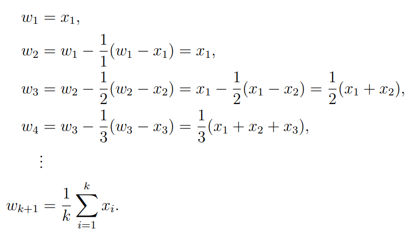
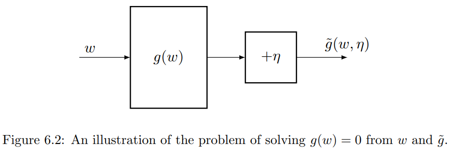

# 随机近似

本章介绍随机近似（Stochastic Approximation）的基础知识。为后面的时序差分（temporal-difference）算法做铺垫。

前面章节的算法都是非增量的，后续的章节会开始学习增量的算法。

## 均值估计

这里给出一个示例，展示如何将一个非增量的算法转换成一个增量的算法。

考虑一个随机变量 $X$，它从表示为 $\mathcal{X}$ 的有限实数集中获取值。我们的目标是计算 $X$ 的期望： $\mathbb{E}[X]$。

如果随机变量 $X$ 的概率分布是未知的，假定我们有一系列独立同分布的样本 $\{x_i\}^n_{i=1}$，那么 $X$ 的期望可以近似为

$$ \mathbb{E}[X] \approx \bar{x} = \frac{1}{n} \sum^n_{i=1} x_i$$

当 $ n \rightarrow \infin $ 时，$ \bar{x} \rightarrow \mathbb{E}[X] $。

这个近似值是蒙特卡洛估计的基本概念。这种方法的缺点是，如果样本数量很大，我们可能需要等待很长时间才能收集到所有样本。下面介绍增量的方法。

假定：

$$ w_{k+1}= \frac{1}{k} \sum^k_{i=1} x_i, \ k=1,2,...$$

那么 

$$ w_{k}= \frac{1}{k-1} \sum^{k-1}_{i=1} x_i, \ k=2,3,...$$

因此 $w_{k+1}$ 可以使用 $w_{k}$ 来表示：

$$\begin{aligned}
w_{k+1}= \frac{1}{k} \sum^k_{i=1} x_i &= \frac{1}{k} ( \sum^{k-1}_{i=1} x_i + x_k ) \\
&=  \frac{1}{k} ( (k-1) \cdot w_k + x_k ) \\
&=  w_k- \frac{1}{k} ( w_k - x_k )
\end{aligned}$$ 

因此我们得到如下增量的算法：

$$ w_{k+1}= w_k- \frac{1}{k} ( w_k - x_k ) $$

可以验证如下：



该算法的优点是每次收到样本时都可以立即计算平均值。

进一步，考虑一个更通用表达式的算法：

$$ w_{k+1}= w_k-  \alpha_k ( w_k - x_k ) $$

我们将在下一节中说明，如果 $\{\alpha_k\}$ 满足一些温和的条件，当 $ k \rightarrow \infin $ 时，$ w_k \rightarrow \mathbb{E}[X] $。

## Robbins-Monro 算法


假定，要求解如下方程的根：

$$ g(w) = 0 $$

其中 $w$ 是未知变量，函数 $g: \mathbb{R} \rightarrow \mathbb{R}$。 $g$ 是未知函数，同时其导数也未知。

但是我们可以获得 $g(w)$ 的带噪声的观测值：

$$ \widetilde{g} (w, \eta) = g(w) + \eta $$

其中 $\eta$ 是观测误差，它可能是也可能不是高斯误差。

总之，这是一个黑盒系统，只有输入 $w$ 和带有噪声的输出 $\widetilde{g} (w, \eta)$ 是可以获得的，我们的目标是使用 $w$ 和  $\widetilde{g}$ 来求解 $ g(w) = 0 $。



RM 算法通过如下方式求解 $ g(w) = 0 $：

$$ w_{k+1}= w_k-  \alpha_k \widetilde{g} (w, \eta), \quad k=1,2,3,... $$

其中 $w_k$ 是第 $k\text{th}$ 次根的估计值，$\widetilde{g} (w, \eta)$ 是第 $k\text{th}$ 次观测到的带噪声的值，$\alpha_k$ 是一个正的系数。

可以看出，RM 算法不需要有关该函数的任何信息。它只需要输入和输出。

### 示例

考虑如下
- 函数 $g(w) = w^3 -5$，求根 $g(w) = w^3 -5 = 0$，其真实的根 $ w^* = 5^{1/3} \approx  1.71$。
- 函数 $g(w) = tanh(w −1)$，求根 $g(w) = 0$，其真实的根 $w^* =0$。

给定任意一个初始值 $w_0 = 2$，$\alpha_k = 1/k$。


```
import numpy as np

def g1(w):
    return w**3 - 5

def g2(w):
    return np.tanh(w - 1)

def robbins_monro(w0, g, max_iter=100000, epsilon=1e-3):
    w = w0
    for k in range(1, max_iter+1):
        gamma_k = 1 / k
        w_next = w - gamma_k * g(w)
        print(f"k: {k}, w: {np.round(w,5)}, g(w): {np.round(g(w),5)}, w_next: {np.round(w_next,5)}")
        if abs(g(w_next)) < epsilon:
            break
        w = w_next
    return w

# 初始化
w0 = 2.0  # 初始值

# 运行算法
root = robbins_monro(w0, g1)
print(f"Root found: {root}")

root = robbins_monro(w0, g2)
print(f"Root found: {root}")
```

函数 $g(w) = w^3 -5 = 0$ 的求解过程如下：

```
k: 1, w: 2.0, g(w): 3.0, w_next: -1.0
k: 2, w: -1.0, g(w): -6.0, w_next: 2.0
k: 3, w: 2.0, g(w): 3.0, w_next: 1.0
k: 4, w: 1.0, g(w): -4.0, w_next: 2.0
k: 5, w: 2.0, g(w): 3.0, w_next: 1.4
k: 6, w: 1.4, g(w): -2.256, w_next: 1.776
k: 7, w: 1.776, g(w): 0.60182, w_next: 1.69003
k: 8, w: 1.69003, g(w): -0.17297, w_next: 1.71165
k: 9, w: 1.71165, g(w): 0.01467, w_next: 1.71002
Root found: 1.7116470131387955
```

但是当 $w_0$ 过大时，会导致溢出，比如 $w_0=5$。

```
k: 1, w: 5.0, g(w): 120.0, w_next: -115.0
k: 2, w: -115.0, g(w): -1520880.0, w_next: 760325.0
k: 3, w: 760325.0, g(w): 4.395394008593281e+17, w_next: -1.465131336190157e+17
k: 4, w: -1.465131336190157e+17, g(w): -3.1450653318566366e+51, w_next: 7.862663329641591e+50
k: 5, w: 7.862663329641591e+50, g(w): 4.860814415992671e+152, w_next: -9.721628831985343e+151
```

函数 $g(w) = tanh(w −1) = 0$ 的求解过程如下：

```
k: 1, w: 2.0, g(w): 0.76159, w_next: 1.23841
k: 2, w: 1.23841, g(w): 0.23399, w_next: 1.12141
k: 3, w: 1.12141, g(w): 0.12082, w_next: 1.08114
k: 4, w: 1.08114, g(w): 0.08096, w_next: 1.0609
k: 5, w: 1.0609, g(w): 0.06082, w_next: 1.04873
...
k: 240, w: 1.00102, g(w): 0.00102, w_next: 1.00102
k: 241, w: 1.00102, g(w): 0.00102, w_next: 1.00101
k: 242, w: 1.00101, g(w): 0.00101, w_next: 1.00101
k: 243, w: 1.00101, g(w): 0.00101, w_next: 1.001
k: 244, w: 1.001, g(w): 0.001, w_next: 1.001
Root found: 1.0010032332524639
```

但是当 $w_0$ 过大时，收敛会比较慢。

### Robbins-Monro 定理

**Robbins-Monro 定理**：如果满足如下条件：
1. $0 < c_1 \leq \nabla_w g(w) \leq c_2 \  \text{for all } w;$
2. $\sum_{k=1}^\infty a_k = \infty \  \text{and} \  \sum_{k=1}^\infty a_k^2 < \infty;$
3. $\mathbb{E}[\eta_k | \mathcal{H}_k] = 0 \  \text{and} \ \mathbb{E}[\eta_k^2 | \mathcal{H}_k] < \infty;$

其中 $\mathcal{H}_k = \{w_k, w_{k-1}, ... \}$，那么 $w_k$ 几乎可以肯定地收敛到 $ g(w^*) = 0 $ 的根 $w^*$。

定理中的三个条件解释如下：

- 条件一中 $0 < c_1 \leq \nabla_w g(w)$ 表明 $g(w)$ 是一个单调递增函数。此条件确保  $g(w)=0$ 的根存在且唯一。
  - 我们可以将目标函数为 $J(w)$ 的优化问题表述为求根问题： $g(w) = \nabla_w J(w)=0$。
  - 在这种情况下，$g(w)$ 是单调递增的条件表明 $J(w)$ 是凸的（convex）。
- $\nabla_w g(w) \leq c_2$ 表明 $g(w)$ 的梯度是有上界的。
  - 示例函数 $g(w) = tanh(w −1)$ 满足这个条件，但是 $g(w) = w^3 -5$ 就不满足。
- 条件二中 $\sum_{k=1}^\infty a_k^2 < \infty$ 表明 $ \lim_{n \rightarrow \infty}\sum_{k=1}^n a_k^2 $ 是收敛并有上界的。条件 $\sum_{k=1}^\infty a_k$ 表明 $ \lim_{n \rightarrow \infty}\sum_{k=1}^n a_k $ 不收敛并趋近于无穷。它要求 $a_k$ 不应太快收敛到 $0$。
- 条件三不需要观测误差 $\eta$ 为高斯误差。一种特殊的情况是 $\{\eta_k\}$ 是独立同分布的随机序列，同时满足 $\mathbb{E}[\eta_k ] = 0$ 和 $\mathbb{E}[\eta^2_k ] = 0$。这种情况下由于 $\eta_k$ 独立于 $\mathcal{H}_k$，因此满足第三个条件。

## 随机梯度下降

这里介绍随机梯度下降（Stochastic gradient descent）算法。